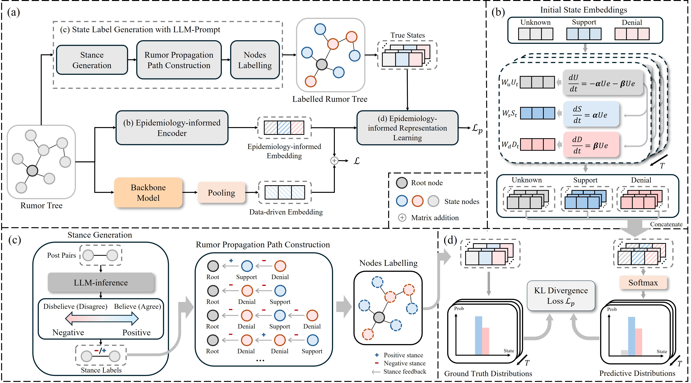

# EIN

This repository is the implementation of The Web Conference 2025 (WWW'25) paper: Epidemiology-informed Network for Robust Rumor Detection



run main.py to train and test the model.

## Requirements:
- python==3.12
- pytorch==2.3.1
- torch_geometric==2.5.3
- tqdm==4.66.4
- sklearn==1.5.0
- scipy==1.14.0
- numpy==1.26.4
- pandas==2.2.2
- jieba==0.42.1
- nltk==3.8.1
- gensim==4.3.2
- transformers==4.42.3
- yaml==0.2.5

## TCSR Prototype

This repository also includes a standalone prototype for **TCSR: Thresholded
Collective Stance Revision for Rumor Detection**.

Files:

- `model/model_tcsr.py`: modular TCSR model and `compute_tcsr_loss`
- `train_tcsr.py`: minimal multi-seed training script
- `utils_metrics.py`: accuracy and macro-F1 helpers

Each PyG `Data` object should contain:

- `data.x`: node text features, shape `[num_nodes, input_dim]`
- `data.edge_index`: propagation edges, shape `[2, num_edges]`
- `data.y`: graph label, shape `[1]` or scalar

Optional fields:

- `data.root_index`: root node index. Defaults to the first node of each graph.
- `data.depth`: node depth. If absent, TCSR computes it from `edge_index`.
- `data.stance_probs`: soft stance distribution `[num_nodes, 3]` in
  support/challenge/uncertain order.
- `data.stance_labels`: optional node stance labels for auxiliary supervision.

GPU note: pass `--device cuda` to train on GPU. The training script moves each
PyG batch to the selected device, and the model keeps depth expansion,
aggregation, thresholding, and diagnostic scoring on that same device whenever
the input batch is on GPU.

Example with existing processed split directories:

```bash
python train_tcsr.py --dataset_dir data/Pheme --device cuda
```

Example with an EIN-style config file that builds dataset paths automatically:

```bash
python train_tcsr.py --config_filename configs/EIN/DRWeibo_TCSR_word2vec.yaml
python train_tcsr.py --config_filename configs/EIN/Weibo_TCSR_word2vec.yaml
python train_tcsr.py --config_filename configs/EIN/Pheme_TCSR_word2vec.yaml
```

Example with explicit PyG `.pt` split files:

```bash
python train_tcsr.py \
  --train_path path/to/train.pt \
  --val_path path/to/val.pt \
  --test_path path/to/test.pt \
  --device cuda
```

Example with one `.pt` file and five seed re-splits:

```bash
python train_tcsr.py --data_path path/to/all_graphs.pt --seeds 0,1,2,3,4
```

Ablation flags are available with paired CLI switches:

```bash
python train_tcsr.py --dataset_dir data/Pheme --no-use_threshold --no-use_isolation
```
