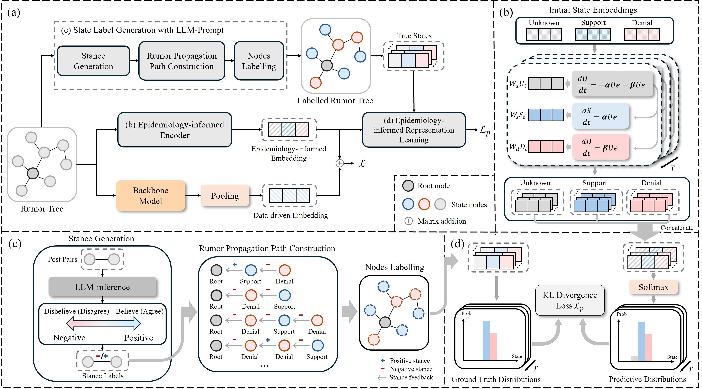

# EIN

This repository is the implementation of The Web Conference 2025 (WWW'25) paper: Epidemiology-informed Network for Robust Rumor Detection



run main.py to train and test the model.

## Cross-dataset OOD experiments

The six directed transfers among DRWeibo, Weibo and Pheme reuse the existing
models through `experiment_mode: ood`. Each source has a fixed 80/20
train/validation split; target data is used only for final evaluation. Repeated
source posts are deduplicated before splitting, and source-overlapping target
posts are excluded. The two targets share the same source split for each seed.

```bash
python scripts/prepare_ood_splits.py --all-pairs --output-dir dataset/ood_splits
python main.py --config_filename configs/ood/DRWeibo_to_Weibo_BiGCN_e5.yaml --seed 0
```

Shared multilingual E5 features allow the same model architecture to transfer
between Chinese and English. See [docs/OOD.md](docs/OOD.md) for all six configs,
audit counts, source-only Word2Vec, and converting other model configurations.
These are zero-shot cross-dataset protocols inspired by CSDA, not a reproduction
of its COVID19 datasets or causal subgraph model.

## Plain GCN baseline

`model/GCN.py` provides a plain GCN (`base_model: Plain_GCN`): two
normalized GCNConv layers with self-loops, ReLU/dropout, mean pooling and a
linear classifier. It uses only node text features and propagation edges,
with no residual, stance, semantic-change, or auxiliary-loss branches.
The three Word2Vec configs use undirected graphs, the existing dataset
splits, and validation-loss checkpoint selection:

```bash
python main.py --config_filename configs/EIN/Pheme_GCN_word2vec.yaml
python main.py --config_filename configs/EIN/Weibo_GCN_word2vec.yaml
python main.py --config_filename configs/EIN/DRWeibo_GCN_word2vec.yaml
```

Each command runs seeds 0–4; add `--seed 0` for a single run or
`--device cpu` to override the device. Results are saved under
`experiments/EIN/<dataset>/plain_gcn_undirected_valloss_word2vec/`.

## DIGNN-inspired rumor detection

`model/DIGNN.py` separates a structure-only propagation encoder from a text
MLP, fuses event representations with attention, and trains with view
reconstruction and an HSIC independence penalty. This adapts the ICDM 2022
DIGNN ideas to graph-level rumor detection; HSIC replaces the paper's
variational mutual-information objective.

```bash
python main.py --config_filename configs/EIN/Pheme_DIGNN_word2vec.yaml --seed 0
python main.py --config_filename configs/EIN/Weibo_DIGNN_word2vec.yaml --seed 0
python main.py --config_filename configs/EIN/DRWeibo_DIGNN_word2vec.yaml --seed 0
```

The configs reuse existing Word2Vec features, graph caches and splits. Omit
`--seed` to run seeds 0–4; add `--device cpu` for CPU execution.
See [docs/DIGNN.md](docs/DIGNN.md) for the paper-to-code mapping, losses and ablations.

## NodeIGM

The graph-level NodeIGM model learns evidence edges and trains on multiple
restored-edge environments. Nodes isolated after edge selection are excluded
from graph pooling, including the source node. The three ID Word2Vec configs
reuse the existing GCN data caches and select checkpoints by validation loss:

```bash
python main.py --config_filename configs/EIN/Pheme_NodeIGM_word2vec.yaml --seed 0
python main.py --config_filename configs/EIN/Weibo_NodeIGM_word2vec.yaml --seed 0
python main.py --config_filename configs/EIN/DRWeibo_NodeIGM_word2vec.yaml --seed 0
```

Omit `--seed` to run all five seeds, or add `--device cpu` for CPU execution.
See [docs/NodeIGM.md](docs/NodeIGM.md) for the model interface and parameters.

## GroupGain

GroupGain forms deterministic reply groups before message passing, deduplicates
group relations, and predicts conditional discriminative gain to gate messages
and graph readout. The dedicated trainer selects and freezes an ungated teacher,
pretrains the gain head, then jointly trains the student using classification and
gain losses. All three configs reuse the existing fixed Word2Vec features and
event splits, with validation-loss checkpoint selection and generic relations:

```bash
python main.py --config_filename configs/EIN/DRWeibo_GroupGain_word2vec.yaml --seed 0
python main.py --config_filename configs/EIN/Weibo_GroupGain_word2vec.yaml --seed 0
python main.py --config_filename configs/EIN/Pheme_GroupGain_word2vec.yaml --seed 0
```

Omit `--seed` to run seeds 0–4; add `--device cpu` for CPU execution.
Teacher, gain-head and student training budgets are independently configurable.
Results are saved under
`experiments/EIN/<dataset>/group_gain_full_undirected_valloss_word2vec/seed_<seed>/`.
The student checkpoint supports inference without the teacher or gain targets.
See [docs/GroupGain.md](docs/GroupGain.md) for stages, ablations and limitations.

## SHPA

The repository includes the paper's stance-aware heterogeneous propagation
and cross-sample alignment model. It reuses the existing Word2Vec graph caches
and their offline Gemma support/deny edge labels:

```bash
python main.py --config_filename configs/EIN/Pheme_SHPA_word2vec.yaml --seed 0
python main.py --config_filename configs/EIN/Weibo_SHPA_word2vec.yaml --seed 0
python main.py --config_filename configs/EIN/DRWeibo_SHPA_word2vec.yaml --seed 0
```

See [docs/SHPA.md](docs/SHPA.md) for the equation-to-code mapping, cache
behavior, model location, implementation choices, and validation commands.
Set `shpa_backbone` in any SHPA config to `gcn`, `resgcn`, or `bigcn`; all
three choices keep using the same processed graph cache.

## P2T3

The repository includes an EIN-compatible implementation of **P2T3:
Pre-Trained Propagation Tree Transformer**. It converts each propagation tree
to source, deep-conversation-chain, and shallow-conversation tokens, then adds
the released orthogonal chain identifiers, sinusoidal depth embeddings, and
conversation-type embeddings before Transformer encoding.

Ready-to-run Word2Vec configurations are available for the project datasets:

```bash
python scripts/pretrain_p2t3.py --config_filename configs/EIN/DRWeibo_P2T3_word2vec.yaml --device cuda:0
python main.py --config_filename configs/EIN/DRWeibo_P2T3_word2vec.yaml
python main.py --config_filename configs/EIN/Weibo_P2T3_word2vec.yaml
python main.py --config_filename configs/EIN/Twitter_P2T3_word2vec.yaml
python main.py --config_filename configs/EIN/Pheme_P2T3_word2vec.yaml
```

Put the downloaded unlabeled JSON files directly under
`dataset/UWeibo/dataset/raw` for Chinese experiments or
`dataset/UTwitter/dataset/raw` for English experiments. The native pre-training
command builds one shared Word2Vec encoder, caches conversation-chain tensors
under that dataset's `processed` directory, optimizes the released JSD
local-global MI objective, and saves the stable checkpoint configured by
`p2t3_pretrained_path`. Running the command again resumes that checkpoint.
The classifier is intentionally reinitialized during EIN fine-tuning.
`p2t3_unsup_weight` can additionally apply the MI objective during supervised
fine-tuning; it defaults to `0.0`, matching the released fine-tuning script.

## Requirements:
- python==3.12
- pytorch==2.3.1
- torch_geometric==2.5.3
- tqdm==4.66.4
- sklearn==1.5.0
- scipy==1.14.0
- numpy==1.26.4
- pandas==2.2.2
- jieba==0.42.1
- nltk==3.8.1
- gensim==4.3.2
- transformers==4.42.3
- yaml==0.2.5

## TCSR Prototype

This repository also includes a standalone prototype for **TCSR: Thresholded
Collective Stance Revision for Rumor Detection**.

Files:

- `model/model_tcsr.py`: modular TCSR model and `compute_tcsr_loss`
- `train_tcsr.py`: minimal multi-seed training script
- `utils_metrics.py`: acc/auc/f1 helpers matching the existing trainer

Each PyG `Data` object should contain:

- `data.x`: node text features, shape `[num_nodes, input_dim]`
- `data.edge_index`: propagation edges, shape `[2, num_edges]`
- `data.y`: graph label, shape `[1]` or scalar

Optional fields:

- `data.root_index`: root node index. Defaults to the first node of each graph.
- `data.depth`: node depth. If absent, TCSR computes it from `edge_index`.
- `data.stance_probs`: soft stance distribution `[num_nodes, 3]` in
  support/challenge/uncertain order.
- `data.stance_labels`: optional node stance labels for auxiliary supervision.

Backbone selection is controlled by `conv_type` in the TCSR config:

- `gcn`: lightweight PyG GCN encoder
- `gat`: lightweight PyG GAT encoder
- `bigcn`: BiGCN-style top-down + bottom-up propagation encoder
- `resgcn`: ResGCN-style residual graph encoder

GPU note: pass `--device cuda` to train on GPU. The training script moves each
PyG batch to the selected device, and the model keeps depth expansion,
aggregation, thresholding, and diagnostic scoring on that same device whenever
the input batch is on GPU.

Example with existing processed split directories:

```bash
python train_tcsr.py --dataset_dir data/Pheme --device cuda
```

Example with an EIN-style config file that builds dataset paths automatically:

```bash
python main.py --config_filename configs/EIN/DRWeibo_TCSR_word2vec.yaml
python main.py --config_filename configs/EIN/Weibo_TCSR_word2vec.yaml
python main.py --config_filename configs/EIN/Pheme_TCSR_word2vec.yaml
```

The same config files can also be run through `train_tcsr.py`, but `main.py`
is the preferred project-level entry point because it matches the existing
five-seed experiment and summary flow.

Example with explicit PyG `.pt` split files:

```bash
python train_tcsr.py \
  --train_path path/to/train.pt \
  --val_path path/to/val.pt \
  --test_path path/to/test.pt \
  --device cuda
```

Example with one `.pt` file and five seed re-splits:

```bash
python train_tcsr.py --data_path path/to/all_graphs.pt --seeds 0,1,2,3,4
```

Ablation flags are available with paired CLI switches:

```bash
python train_tcsr.py --dataset_dir data/Pheme --no-use_threshold --no-use_isolation
```

## LIRS-EBGCN

`LIRS_EBGCN` is an end-to-end, spuriosity-aware extension of EBGCN. It learns
a shortcut-biased node view, removes its projected component before Bayesian
edge inference, and regularizes the resulting graph representation with
biased infomax, HSIC, and online class-conditional spurious prototypes.

The same model supports both propagation backbones through one configuration
field:

```yaml
base_model: LIRS_EBGCN
lirs_ebgcn_backbone: bigcn  # choices: bigcn, resgcn
```

Ready-to-run Word2Vec configurations are provided for all project datasets:

```bash
python main.py --config_filename configs/EIN/Pheme_LIRS_EBGCN_word2vec.yaml
python main.py --config_filename configs/EIN/Weibo_LIRS_EBGCN_word2vec.yaml
python main.py --config_filename configs/EIN/DRWeibo_LIRS_EBGCN_word2vec.yaml
python main.py --config_filename configs/EIN/Twitter_LIRS_EBGCN_word2vec.yaml
```

To run the ResGCN variant, change only `lirs_ebgcn_backbone` to `resgcn` in
the selected file. The dataset cache and loader are selected automatically.
